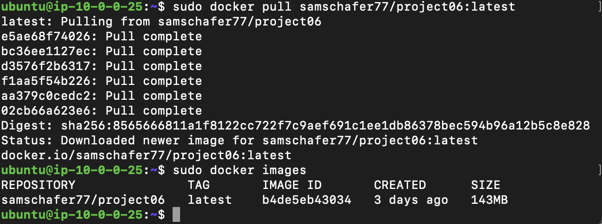
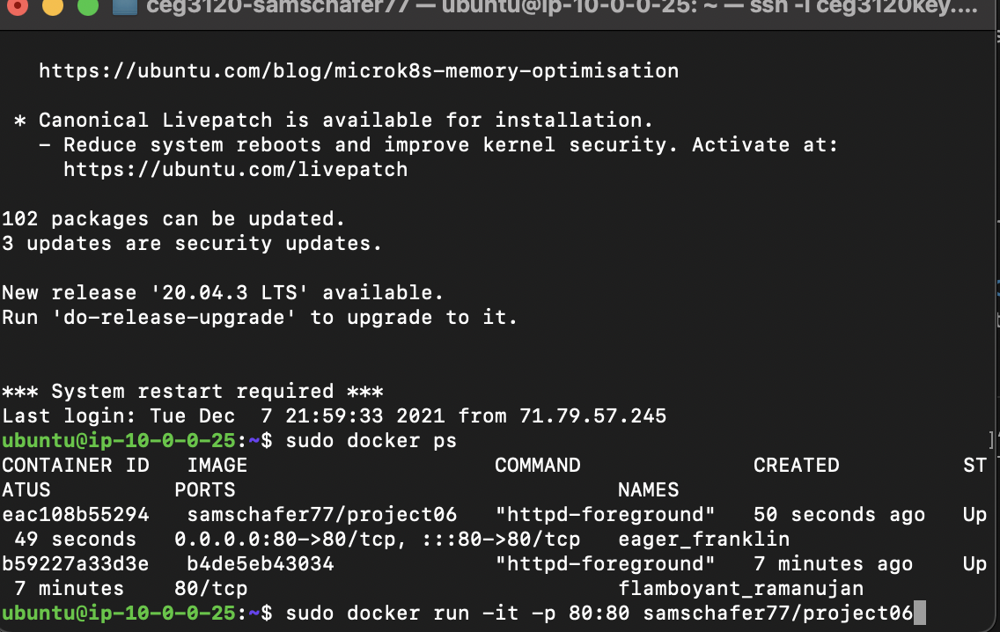

**Project6 Part1**
**Sam Schafer**

**Project Overview**
- I have created a docker file container that when built and ran will get an apache2 webserver up and running on a linux machine.

**Docker Install and Dependencies**
- On an Ubuntu server I ran sudo snap install docker to install docker.
- On an Ubuntu server I ran sudo apt install apache2.

**How to build the Container**
- To build the container image you must clone my cicd-samschafer77 github repository the, run this command:
    -  sudo docker build -t apache-server:v1 .
**How to Run the Container**
- The command to run the container is:
    - sudo docker run -it -p 80:80 apache-server:v1

**How to View the Project**
- To view the project go to ip address on port 80:
    - 34.193.205.151

**Project6 Part2**

**How to Create a DockerHub Repo**
- I created an account on DockerHub and then created a free public repo on my account.

**Allow DockerHub authentication via CLI using Dockhub credentials**
- Access tokens can be created for authentication purposes, these are treated like passwords.

**Configure GitHub Secrets**
- Both username and password are needed to be added to GitHub secrets in the security tab. 
- To set these secrets you must click add secret then the secret variable name and then insert its contents in the text box below.

**Configure GitHub Workflow**
- I created a GitHub workflow in a yml file from an auto generated yml Docker Image template created by GitHub. 
- Inside of this auto generated yml file I created a env: and added a user and password variable by doing "${{secrets.DOCKER_PASSWORD}}" and DOCKER_USER: ${{secrets.DOCKER_USER}}for example.
- I also had to add my username and the repo name "samschafer77/project06" to the yml to give it the name of the repo that to build in.
- Finally I had to push to the DockerHub after the build and I had to add "${{secrets.DOCKER_USER}}/project06" to the push command.

**Here is my .yml for easy viewing**

        name: Docker Image CI

        on:
          push:
            branches: [ main ]
          pull_request:
            branches: [ main ]

        jobs:

          build:

            runs-on: ubuntu-latest

            steps:
            - uses: actions/checkout@v2
            - name: docker login
              env: 
                DOCKER_USER: ${{secrets.DOCKER_USER}}
                DOCKER_PASSWORD: ${{secrets.DOCKER_PASSWORD}}
              run:
                docker login -u $DOCKER_USER -p $DOCKER_PASSWORD
            - name: Build the Docker image
              run: docker build . --file Dockerfile --tag samschafer77/project06

            - name: Docker Push
              run: docker push ${{secrets.DOCKER_USER}}/project06
  
**Project6 Part3**

**Pulling the image**
- I pulled the dockerhub image using the "docker pull samschafer77/project06:latest" command.

**Running the container**
- I ran the container using the "sudo docker run -it -p 80:80 samschafer77/project06" command.

**How to view webpage**
- I pulled and ran the container on the same ubuntu server as in part 1 because AWS console has been down as of 12/7 and I could not create a new server.
  - The IP address is still: 34.193.205.151